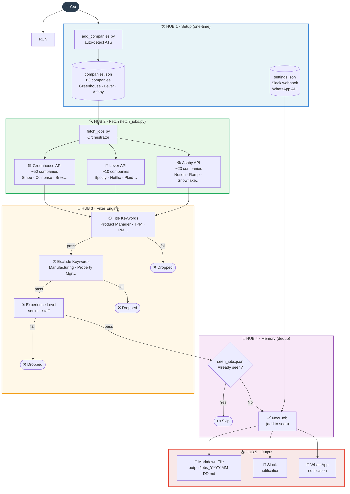

# PM Job Fetcher — System Diagram

Paste the Mermaid block below into any of these:
- **GitHub** — paste directly into any `.md` file
- **Notion** — create a Code block, select "Mermaid"
- **VS Code** — install "Markdown Preview Mermaid Support" extension
- **Live editor** — go to mermaid.live and paste

---



---

## Hub & Spoke Summary

| Hub | Role | Spokes |
|-----|------|--------|
| **Setup** | One-time config | companies.json · settings.json · add_companies.py |
| **Fetch** | Pull raw jobs from ATS APIs | Greenhouse · Lever · Ashby |
| **Filter** | Narrow to relevant roles | Title Keywords → Exclude Keywords → Experience Level |
| **Memory** | Avoid duplicate alerts | seen_jobs.json → new vs. already-seen |
| **Output** | Deliver results | Markdown file · Slack · WhatsApp |

## How to run

```bash
python3 fetch_jobs.py          # fetch new jobs only
python3 fetch_jobs.py --all    # ignore history, show everything
python3 fetch_jobs.py --reset  # clear history and start fresh
```
